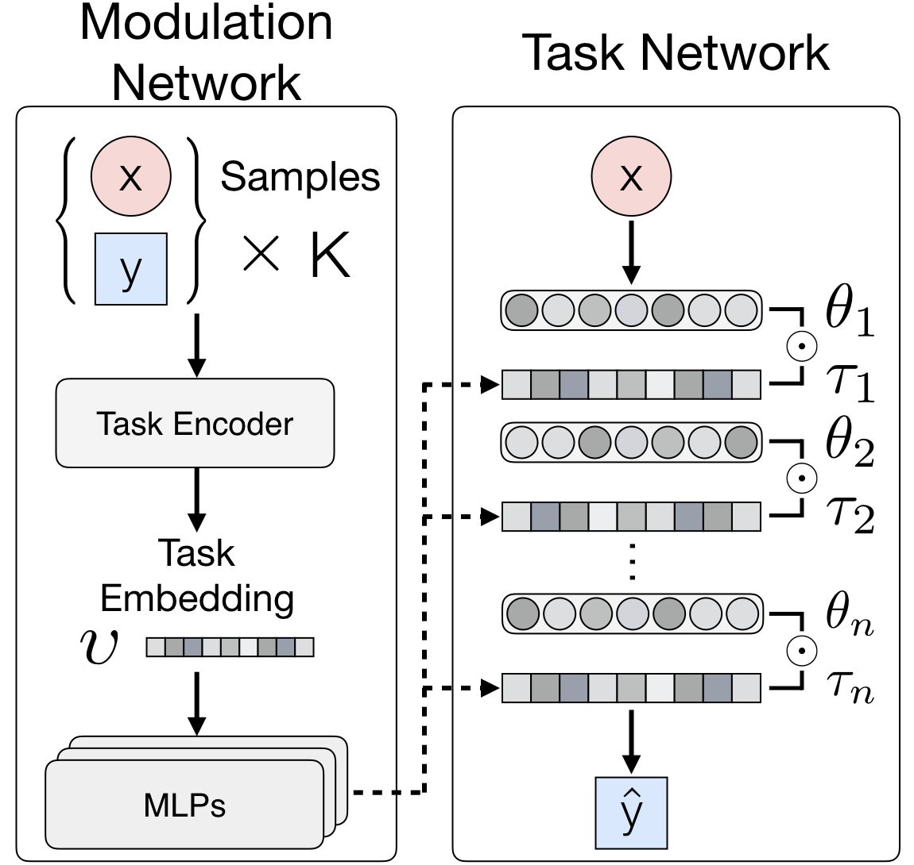
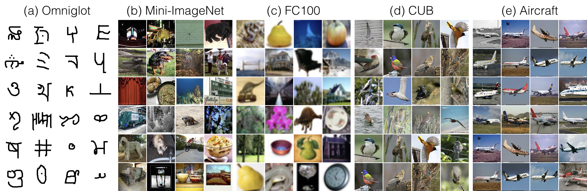
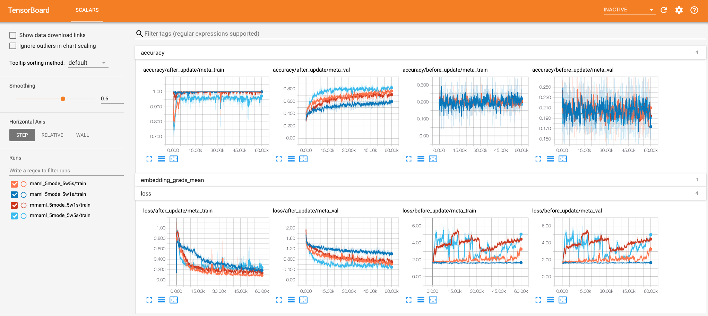

# Multimodal Model-Agnostic Meta-Learning for Few-shot Classification

This project is an implementation of [**Multimodal Model-Agnostic Meta-Learning via Task-Aware Modulation**](https://arxiv.org/abs/1910.13616), which is published in [**NeurIPS 2019**](https://neurips.cc/Conferences/2019/). Please visit our [project page](https://vuoristo.github.io/MMAML/) for more information and contact [Shao-Hua Sun](http://shaohua0116.github.io/) for any questions.

Model-agnostic meta-learners aim to acquire meta-prior parameters from a distribution of tasks and adapt to novel tasks with few gradient updates. Yet, seeking a common initialization shared across the entire task distribution substantially limits the diversity of the task distributions that they are able to learn from. We propose a multimodal MAML (MMAML) framework, which is able to modulate its meta-learned prior according to the identified mode, allowing more efficient fast adaptation. An illustration of the proposed framework is as follows.

<p align="center">
    
</p>

We evaluate our model and baselines (MAML and Multi-MAML) on multiple multimodal settings based on the following five datasets: (a) [Omniglot](https://www.omniglot.com/), (b) [Mini-ImageNet](https://openreview.net/forum?id=rJY0-Kcll), (c) [FC100](https://arxiv.org/abs/1805.10123) (e.g. CIFAR100), (d) [CUB-200-2011](http://www.vision.caltech.edu/visipedia/CUB-200-2011.html), and (e) [FGVC-Aircraft](https://arxiv.org/abs/1306.5151). 

<p align="center">
    
</p>

## Datasets

Run the following command to download and preprocess the datasets

```bash
python download.py --dataset aircraft bird cifar miniimagenet
```

## Getting started

Please first install the following prerequisites: `wget`, `unzip`.

To avoid any conflict with your existing Python setup, and to keep this project self-contained, it is suggested to work in a virtual environment with [`virtualenv`](http://docs.python-guide.org/en/latest/dev/virtualenvs/). To install `virtualenv`:
```
pip install --upgrade virtualenv
```
Create a virtual environment, activate it and install the requirements in [`requirements.txt`](requirements.txt).
```
virtualenv mmaml_venv
source mmaml_venv/bin/activate
pip install -r requirements.txt
```

## Usage

After downloading the datasets, we can start to train models with the following commands.

### Training command

```bash
$ python main.py -dataset multimodal_few_shot --multimodal_few_shot omniglot miniimagenet cifar bird aircraft --mmaml-model True --num-batches 600000 --output-folder mmaml_5mode_5w1s
```
- Selected arguments (see the `trainer.py` for more details)
    - --output-folder: a nickname for the training
    - --dataset: choose among `omniglot`, `miniimagenet`, `cifar`, `bird` (CUB), and `aircraft`. You can also add your own datasets.
    - Checkpoints: specify the path to a pre-trained checkpoint
        - --checkpoint: load all the parameters (e.g. `train_dir/mmaml_5mode_5w1s/maml_gatedconv_60000.pt`).
    - Hyperparameters
        - --num-batches: number of batches
        - --meta-batch-size: number of tasks per batch
        - --slow-lr: learning rate for the global update of MAML
        - --fast-lr: learning rate for the adapted models
        - --num-updates: how many update steps in the inner loop
        - --num-classes-per-batch: how many classes per task (`N`-way)
        - --num-samples-per-class: how many samples per class for training (`K`-shot)
        - --num-val-samples: how many samples per class for validation
        - --max\_steps: the max training iterations
    - Logging
        - --log-interval: number of batches between tensorboard writes
        - --save-interval: number of batches between model saves
    - Model
        - maml-model: set to `True` to train a MAML model
        - mmaml-model: set to `True` to train a MMAML (our) model

### Interpret TensorBoard

Launch Tensorboard and go to the specified port, you can see differernt accuracies and losses in the **scalars** tab.

<p align="center">
    
</p>

You can reproduce our results with the following training commands.

### 2 Modes (Omniglot and Mini-ImageNet)

| Setup | Method | Command                                  |
| :---: | :----: | ---------------------------------------- |
| 5w1s  |  MAML  | ```python main.py --dataset multimodal_few_shot --multimodal_few_shot omniglot miniimagenet --maml-model True --num-batches 600000 --output-folder maml_2mode_5w1s``` |
| 5w1s  |  Ours  | ```python main.py --dataset multimodal_few_shot --multimodal_few_shot omniglot miniimagenet --mmaml-model True --num-batches 600000 --output-folder mmaml_2mode_5w1s``` |
| 5w5s  |  MAML  | ```python main.py --dataset multimodal_few_shot --multimodal_few_shot omniglot miniimagenet --maml-model True --num-batches 600000 --num-samples-per-class 5 --output-folder maml_2mode_5w5s``` |
| 5w5s  |  Ours  | ```python main.py --dataset multimodal_few_shot --multimodal_few_shot omniglot miniimagenet --mmaml-model True --num-batches 600000 --num-samples-per-class 5 --output-folder mmaml_2mode_5w5s``` |
| 20w1s |  MAML  | ```python main.py --dataset multimodal_few_shot --multimodal_few_shot omniglot miniimagenet --maml-model True --num-batches 400000 --meta-batch-size 5 --num-classes-per-batch 20 --output-folder maml_2mode_20w1s``` |
| 20w1s |  Ours  | ```python main.py --dataset multimodal_few_shot --multimodal_few_shot omniglot miniimagenet --mmaml-model True --num-batches 400000 --meta-batch-size 5 --num-classes-per-batch 20 --output-folder mmaml_2mode_20w1s``` |

### 3 Modes (Omniglot, Mini-ImageNet, and FC100)

| Setup | Method | Command                                  |
| :---: | :----: | ---------------------------------------- |
| 5w1s  |  MAML  | ```python main.py --dataset multimodal_few_shot --multimodal_few_shot omniglot miniimagenet cifar --maml-model True --num-batches 600000 --output-folder maml_3mode_5w1s``` |
| 5w1s  |  Ours  | ```python main.py --dataset multimodal_few_shot --multimodal_few_shot omniglot miniimagenet cifar --mmaml-model True --num-batches 600000 --output-folder mmaml_3mode_5w1s``` |
| 5w5s  |  MAML  | ```python main.py --dataset multimodal_few_shot --multimodal_few_shot omniglot miniimagenet cifar --maml-model True --num-batches 600000 --num-samples-per-class 5 --output-folder maml_5mode_5w5s``` |
| 5w5s  |  Ours  | ```python main.py --dataset multimodal_few_shot --multimodal_few_shot omniglot miniimagenet cifar --mmaml-model True --num-batches 600000 --num-samples-per-class 5 --output-folder mmaml_5mode_5w5s``` |
| 20w1s |  MAML  | ```python main.py --dataset multimodal_few_shot --multimodal_few_shot omniglot miniimagenet cifar --maml-model True --num-batches 400000 --meta-batch-size 5 --num-classes-per-batch 20 --output-folder maml_3mode_20w1s``` |
| 20w1s |  Ours  | ```python main.py --dataset multimodal_few_shot --multimodal_few_shot omniglot miniimagenet cifar --mmaml-model True --num-batches 400000 --meta-batch-size 5 --num-classes-per-batch 20 --output-folder mmaml_3mode_20w1s``` |

### 5 Modes (Omniglot, Mini-ImageNet, FC100, Aircraft, and CUB)

| Setup | Method | Command                                  |
| :---: | :----: | ---------------------------------------- |
| 5w1s  |  MAML  | ```python main.py --dataset multimodal_few_shot --maml-model True --num-batches 600000 --output-folder maml_5mode_5w1s``` |
| 5w1s  |  MAML  | ```python main.py --dataset multimodal_few_shot --multimodal_few_shot omniglot miniimagenet cifar bird aircraft --maml-model True --num-batches 600000 --output-folder maml_5mode_5w1s``` |
| 5w1s  |  Ours  | ```python main.py --dataset multimodal_few_shot --mmaml-model True --num-batches 600000 --output-folder mmaml_5mode_5w1s``` |
| 5w1s  |  Ours  | ```python main.py --dataset multimodal_few_shot --multimodal_few_shot omniglot miniimagenet cifar bird aircraft --mmaml-model True --num-batches 600000 --output-folder mmaml_5mode_5w1s``` |
| 5w5s  |  MAML  | ```python main.py --dataset multimodal_few_shot --maml-model True --num-batches 600000 --num-samples-per-class 5 --output-folder maml_5mode_5w5s``` |
| 5w5s  |  MAML  | ```python main.py --dataset multimodal_few_shot --multimodal_few_shot omniglot miniimagenet cifar bird aircraft --maml-model True --num-batches 600000 --num-samples-per-class 5 --output-folder maml_5mode_5w5s``` |
| 5w5s  |  Ours  | ```python main.py --dataset multimodal_few_shot --mmaml-model True --num-batches 600000 --num-samples-per-class 5 --output-folder mmaml_5mode_5w5s``` |
| 5w5s  |  Ours  | ```python main.py --dataset multimodal_few_shot --multimodal_few_shot omniglot miniimagenet cifar bird aircraft --mmaml-model True --num-batches 600000 --num-samples-per-class 5 --output-folder mmaml_5mode_5w5s``` |
| 20w1s |  MAML  | ```python main.py --dataset multimodal_few_shot --maml-model True --num-batches 400000 --meta-batch-size 5 --num-classes-per-batch 20 --output-folder maml_5mode_20w1s``` |
| 20w1s |  MAML  | ```python main.py --dataset multimodal_few_shot --multimodal_few_shot omniglot miniimagenet cifar bird aircraft --maml-model True --num-batches 400000 --meta-batch-size 5 --num-classes-per-batch 20 --output-folder maml_5mode_20w1s``` |
| 20w1s |  Ours  | ```python main.py --dataset multimodal_few_shot --mmaml-model True --num-batches 400000 --meta-batch-size 5 --num-classes-per-batch 20 --output-folder mmaml_5mode_20w1s``` |
| 20w1s |  Ours  | ```python main.py --dataset multimodal_few_shot --multimodal_few_shot omniglot miniimagenet cifar bird aircraft --mmaml-model True --num-batches 400000 --meta-batch-size 5 --num-classes-per-batch 20 --output-folder mmaml_5mode_20w1s``` |

### Multi-MAML

| Setup |    Dataset    | Command                                  |
| :---: | :-----------: | ---------------------------------------- |
| 5w1s  |   Omniglot    | ```python main.py --dataset multimodal_few_shot --multimodal_few_shot omniglot --maml-model True --fast-lr 0.4 --num-update 1 --num-batches 600000 --output-folder multi_omniglot_5w1s``` |
| 5w1s  | Mini-ImageNet | ```python main.py --dataset multimodal_few_shot --multimodal_few_shot miniimagenet --maml-model True --fast-lr 0.01 --meta-batch-size 4 --num-batches 320000 --output-folder multi_miniimagenet_5w1s``` |
| 5w1s  |     FC100     | ```python main.py --dataset multimodal_few_shot --multimodal_few_shot cifar --maml-model True --fast-lr 0.01 --meta-batch-size 4 --num-batches 320000 --output-folder multi_cifar_5w1s``` |
| 5w1s  |     Bird      | ```python main.py --dataset multimodal_few_shot --multimodal_few_shot bird --maml-model True --fast-lr 0.01 --meta-batch-size 4 --num-batches 320000 --output-folder multi_bird_5w1s``` |
| 5w1s  |   Aircraft    | ```python main.py --dataset multimodal_few_shot --multimodal_few_shot aircraft --maml-model True --fast-lr 0.01 --meta-batch-size 4 --num-batches 320000 --output-folder multi_aircraft_5w1s``` |
| 5w5s  |   Omniglot    | ```python main.py --dataset multimodal_few_shot --multimodal_few_shot omniglot --maml-model True --fast-lr 0.4 --num-update 1 --num-batches 600000 --num-samples-per-class 5 --output-folder multi_omniglot_5w5s``` |
| 5w5s  | Mini-ImageNet | ```python main.py --dataset multimodal_few_shot --multimodal_few_shot miniimagenet --maml-model True --fast-lr 0.01 --meta-batch-size 4 --num-batches 320000 --num-samples-per-class 5 --output-folder multi_miniimagenet_5w5s``` |
| 5w5s  |     FC100     | ```python main.py --dataset multimodal_few_shot --multimodal_few_shot cifar --maml-model True --fast-lr 0.01 --meta-batch-size 4 --num-batches 320000 --num-samples-per-class 5 --output-folder multi_cifar_5w5s``` |
| 5w5s  |     Bird      | ```python main.py --dataset multimodal_few_shot --multimodal_few_shot bird --maml-model True --fast-lr 0.01 --meta-batch-size 4 --num-batches 320000 --num-samples-per-class 5 --output-folder multi_bird_5w5s``` |
| 5w5s  |   Aircraft    | ```python main.py --dataset multimodal_few_shot --multimodal_few_shot aircraft --maml-model True --fast-lr 0.01 --meta-batch-size 4 --num-batches 320000 --num-samples-per-class 5 --output-folder multi_aircraft_5w5s``` |
| 20w1s |   Omniglot    | ```python main.py --dataset multimodal_few_shot --multimodal_few_shot omniglot --maml-model True --fast-lr 0.1 --meta-batch-size 4 --num-batches 320000 --num-classes-per-batch 20 --output-folder multi_omniglot_20w1s``` |
| 20w1s | Mini-ImageNet | ```python main.py --dataset multimodal_few_shot --multimodal_few_shot miniimagenet --maml-model True --fast-lr 0.01 --meta-batch-size 4 --num-batches 320000 --num-classes-per-batch 20 --output-folder multi_miniimagenet_20w1s``` |
| 20w1s |     FC100     | ```python main.py --dataset multimodal_few_shot --multimodal_few_shot cifar --maml-model True --fast-lr 0.01 --meta-batch-size 4 --num-batches 320000 --num-classes-per-batch 20 --output-folder multi_cifar_20w1s``` |
| 20w1s |     Bird      | ```python main.py --dataset multimodal_few_shot --multimodal_few_shot bird --maml-model True --fast-lr 0.01 --meta-batch-size 4 --num-batches 320000 --num-classes-per-batch 20 --output-folder multi_bird_20w1s``` |
| 20w1s |   Aircraft    | ```python main.py --dataset multimodal_few_shot --multimodal_few_shot aircraft --maml-model True --fast-lr 0.01 --meta-batch-size 4 --num-batches 320000 --num-classes-per-batch 20 --output-folder multi_aircraft_20w1s``` |


## Results

### 2 Modes (Omniglot and Mini-ImageNet)

|    Method    | 5-way 1-shot | 5-way 5-shot | 20-way 1-shot |
| :----------: | :----------: | :----------: | :-----------: |
|     MAML     |    66.80%    |    77.79%    |    44.69%     |
|  Multi-MAML  |    66.85%    |    73.07%    |    53.15%     |
| MMAML (Ours) |    69.93%    |    78.73%    |    47.80%     |

### 3 Modes (Omniglot, Mini-ImageNet, and FC100)

|    Method    | 5-way 1-shot | 5-way 5-shot | 20-way 1-shot |
| :----------: | :----------: | :----------: | :-----------: |
|     MAML     |    54.55%    |    67.97%    |    28.22%     |
|  Multi-MAML  |    55.90%    |    62.20%    |    39.77%     |
| MMAML (Ours) |    57.47%    |    70.15%    |    36.27%     |

### 5 Modes (Omniglot, Mini-ImageNet, FC100, Aircraft, and CUB)

|    Method    | 5-way 1-shot | 5-way 5-shot | 20-way 1-shot |
| :----------: | :----------: | :----------: | :-----------: |
|     MAML     |    44.09%    |    54.41%    |    28.85%     |
|  Multi-MAML  |    45.46%    |    55.92%    |    33.78%     |
| MMAML (Ours) |    49.06%    |    60.83%    |    33.97%     |

Please check out [our paper](https://arxiv.org/abs/1910.13616) for more comprehensive results.

## Related work
- \[MAML\] [Model-Agnostic Meta-Learning for Fast Adaptation of Deep Networks](https://arxiv.org/abs/1703.03400) in ICML 2017
- [Probabilistic Model-Agnostic Meta-Learning](https://arxiv.org/abs/1806.02817) in NeurIPS 2018
- [Bayesian Model-Agnostic Meta-Learning](https://arxiv.org/abs/1806.03836) in NeurIPS 2018
- [Gradient-Based Meta-Learning with Learned Layerwise Metric and Subspace](https://arxiv.org/abs/1801.05558) in ICML 2018
- [Reptile: A Scalable Meta-Learning Algorithm](https://openai.com/blog/reptile/)
- [Meta-Dataset: A Dataset of Datasets for Learning to Learn from Few Examples](https://arxiv.org/abs/1903.03096) In Meta-Learning Workshop at NeurIPS 2018
- [TADAM: Task dependent adaptive metric for improved few-shot learning](https://arxiv.org/abs/1805.10123) in NeurIPS 2018
- [ProMP: Proximal Meta-Policy Search](https://arxiv.org/abs/1810.06784) in ICLR 2019

## Cite the paper
If you find this useful, please cite
```
@inproceedings{vuorio2019multimodal,
  title={Multimodal Model-Agnostic Meta-Learning via Task-Aware Modulation},
  author={Vuorio, Risto and Sun, Shao-Hua and Hu, Hexiang and Lim, Joseph J.},
  booktitle={Neural Information Processing Systems},
  year={2019},
}
```

## Authors
[Shao-Hua Sun](http://shaohua0116.github.io/), [Risto Vuorio](https://vuoristo.github.io/), [Hexiang Hu](http://hexianghu.com/)
